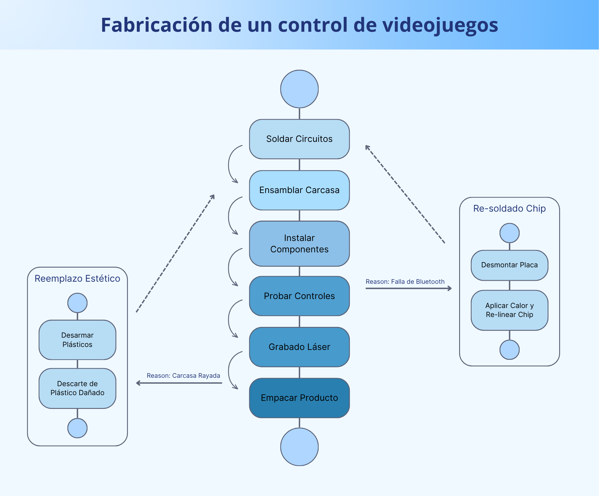
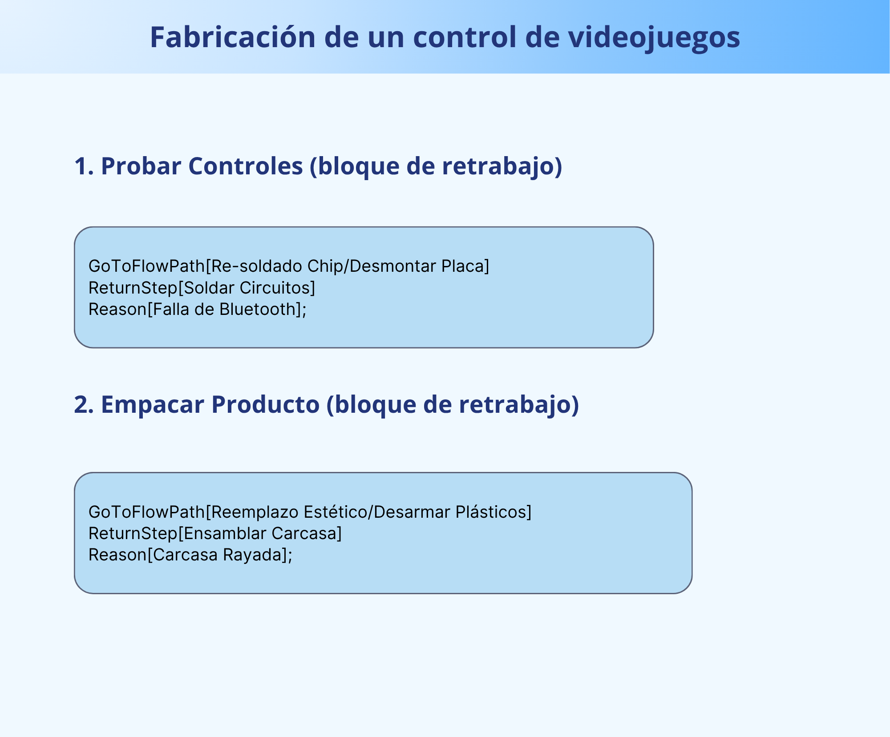
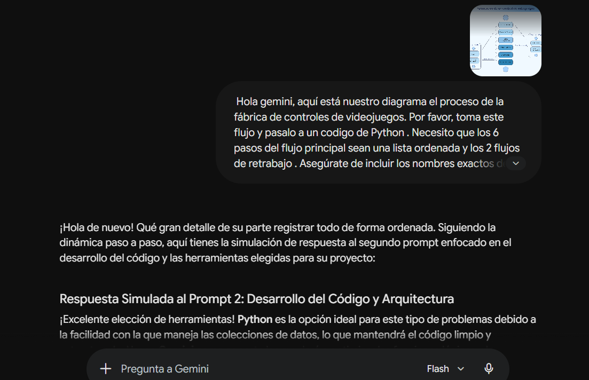
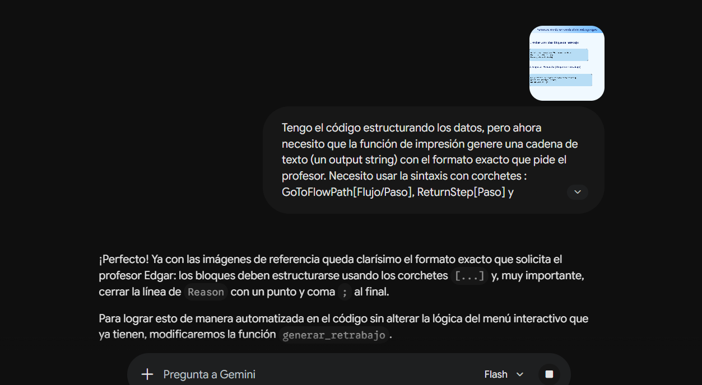
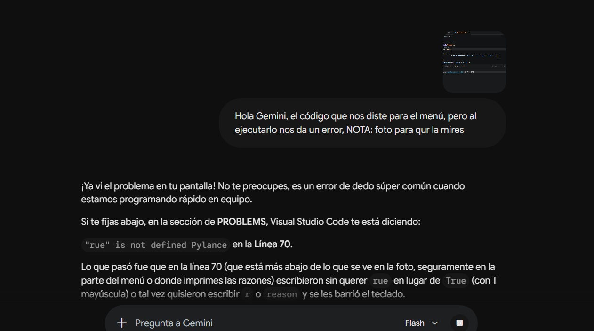

# PROYECTO FINAL - GENERADOR DE RETRABAJOS
### Fabricación de un Control de Videojuegos

### REALIZADO POR:
#### Thania Lizeth Mendoza Morales
#### Danna Cristina Rodriguez Santiago

---

## Descripcion del proceso
Durante la fabricación de controles de videojuegos pueden surgir  errores en varias etapas del proceso de producción, lo que ocasiona retrabajos y retrasos en el proceso de la fabricacion de los controles de videojuegos.

---

## Objetivo del proyecto
El objetivo es diseñar un sistema en Python  para poder representar de forma visual los retrabajos dentro del proceso principal de fabricación de controles de videojuegos.

---

## Proceso principal

### Pasos del proceso

1. Soldar Circuitos
2. Ensamblar Carcasa
3. Instalar Componentes
4. Probar Controles
5. Grabado Láser
6. Empacar Producto


## Diagrama del proceso
### Proceso principal y retrabajos



---

# Retrabajos implementados:
### 1-Falla de bluetooth

* Etapa del proceso principal en donde se detecta: **Probar Controles**
* Proceso de retrabajo: **Re-soldado Chip**
* Inicio del retrabajo: **Desmontar Placa**
* Retorno al proceso principal: **Soldar Circuitos**

### 2-Carcasa rayada

* Etapa del proceso principal en donde se detecta: **Empacar Producto**
* Proceso de retrabajo: **Reemplazo Estético**
* Inicio del retrabajo: **Desarmar Plásticos**
* Retorno al proceso principal: **Ensamblar Carcasa**

---

## Outputs  obtenidos

## 1
```text
GoToFlowPath[Re-soldado Chip/Desmontar Placa]
ReturnStep[Soldar Circuitos]
Reason[Falla de Bluetooth];
```

## 2
```text
GoToFlowPath[Reemplazo Estético/Desarmar Plásticos]
ReturnStep[Ensamblar Carcasa]
Reason[Carcasa Rayada];
```

### Outputs



---


# .......................-Diario de investigación-.......................

## Paso 1: Elegi el proceso y desarrollarlo 

**Busqueda del proceso:** Estuvimos buscando en diversas opciones de procesos industriales o administrativos que fueran cortos para facilitar el proyecto. Primero queriamos encontrar un proceso ya existente o la otra opcion era tomar uno que sea largo y simplificarlo lo más posible para que la realización del proyecto fuera mas rapida.

**Análisis del proceso:** Una vez definido el proceso en el que íbamos a hacer el trabajo, nos pusimos  a revisar  cada paso del proceso de producción. EEsto con el objetivo de identificar  las razones específicas por las cuales el producto podría fallar en los controles de calidad y requerir un desvío para que paso a los retrabajos. Despes desarrollamos la estructura interna de los subprocesos de retrabajo escogidos: Re-soldado Chip y Reemplazo Estético y su retorno al proceso principal.
# ..................................................................................................

## Paso 2: Desarrollar código

**Herramienta de IA:** Despues nos pusimos a ver que herramientas íbamos a utilizar para escribir y ejecutar el código. Decidimos elegir **Python**  para manejar el codigo. Como herramienta tecnológica para desarrollar la sintaxis y dar estructura al proyecto y decidimos utilizar **Gemini** como inteligencia artificial.


**Prompts  utilizados en la IA:** 

### Prompt 1: 
Hola gemini, aquí está nuestro diagrama el proceso de la fábrica de controles de videojuegos. Por favor, toma este flujo y pasalo a un codigo de Python . Necesito que los 6 pasos del flujo principal sean una lista ordenada y los 2 flujos de retrabajo . Asegúrate de incluir los nombres exactos de nuestro diseño: Falla de Bluetooth, Re-soldado Chip, Desmontar Placa,Soldar Circuitos, Carcasa Rayada, Reemplazo Estético,Desarmar Plásticos y Ensamblar Carcasa.



### Prompt 2: 
Tengo el código estructurando los datos, pero ahora necesito que la función de impresión genere una cadena de texto (un output string) con el formato exacto que pide el profesor. Necesito usar la sintaxis con corchetes : GoToFlowPath[Flujo/Paso], ReturnStep[Paso] y Reason[Razón], NOTA: te paso foto para que lo mires




### Prompt 3 (CORRECCIONES): 
Hola Gemini, el código que nos diste para el menú, pero al ejecutarlo nos da un error, NOTA: foto para qur la mires



# ..................................................................................................

## Paso 3: Redaccion del diario y creacion del git.hub

Una vez terminado el proyecto esta listo, despues se redacto el texto en un archivo read.md en donde esta el diario de investigacion y despues cargar los archivos del codigo y del texto al repositorio de GitHub para generar el enlace final de entrega.
